# Symbolic Neural Synchronization Schema (Git Workflow)

This document maps the **OmniCore 3.0 Neurosymbolic Architecture** to our Git and GitHub workflow.

## 🗺️ Visual Diagram

```mermaid
graph LR
    %% Styles
    classDef local fill:#FFD700,stroke:#333,stroke-width:2px,color:black;
    classDef cloud fill:#87CEEB,stroke:#333,stroke-width:2px,color:black;
    classDef process fill:#FFA500,stroke:#333,stroke-width:2px,color:black;
    classDef staging fill:#ADD8E6,stroke:#333,stroke-width:2px,color:black;
    classDef action fill:#FF00FF,stroke:#333,stroke-width:2px,color:white;
    classDef protocol fill:#E6E6FA,stroke:#333,stroke-width:2px,color:black;

    subgraph Layer1 [Layer 1: Symbolic Foundation]
        direction TB
        GitLocal[("⚙️ Git: Local Daemon")]:::local
        GitHubCloud[("🌐 GitHub: Cloud Nexus")]:::cloud
    end

    subgraph Layer2 [Layer 2: Neural Network Flow]
        direction LR
        Input("🧪 Clone / 📤 Fork"):::process
        WorkingDir["NexusNodeLattice\n(Working Directory)"]:::process
        Staging["➕ Staging Area\n(Blue Nodes)"]:::staging
        Commit(("🔺 Commit\n(Synthesis)")):::action
        PushAction["⬆️ Push\n(Final Decision)"]:::action
    end

    subgraph Layer3 [Layer 3: Geometric Protocols]
        direction TB
        Branch["🔀 Branch\n(Sphere)"]:::protocol
        PR["📥 Pull Request"]:::protocol
        Merge["🔁 Merge"]:::protocol
    end

    %% Flow
    GitLocal --> Input
    Input --> WorkingDir
    WorkingDir -- "git add" --> Staging
    Staging -- "git commit" --> Commit
    Commit -- "git push" --> PushAction
    PushAction --> GitHubCloud
    
    GitHubCloud -- "Branching" --> Branch
    Branch -- "Collaboration" --> PR
    PR -- "Synthesis" --> Merge
    Merge --> GitHubCloud
```

## 🔑 Legend & Mapping

### Layer 1: The Symbolic Foundation
*   **🟡 Repository (Tree of Life):** The core data structure holding project history.
*   **⚙️ Git (Local Daemon):** The mechanical tool for local code manipulation.
*   **🌐 GitHub (Cloud Nexus):** The boundless online service for synchronization.

### Layer 2: The Neural Network Flow
*   **🧪 Clone / 📤 Fork:** Bringing the project into the system.
*   **NexusNodeLattice (Orange):** The **Working Directory** where files are actively edited.
*   **➕ Staging Area (Blue):** Files prepared for the next step.
*   **🔺 Commit (Magenta):** The point of synthesis; a snapshot of changes.
*   **⬆️ Push:** Sending committed changes to the remote repository.

### Layer 3: The Geometric Protocols
*   **🔀 Branch:** Independent, interconnected changes (the glowing sphere).
*   **📥 Pull Request:** Initiating review (orbital glyphs).
*   **🔁 Merge:** Combining changes into the main repository.
